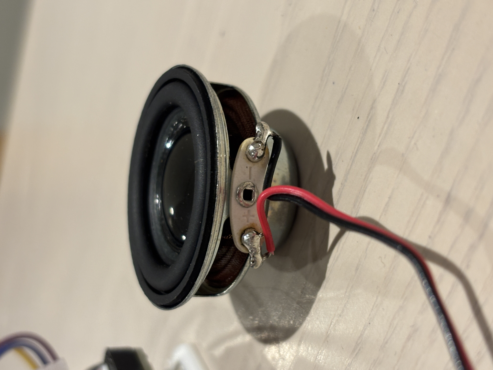
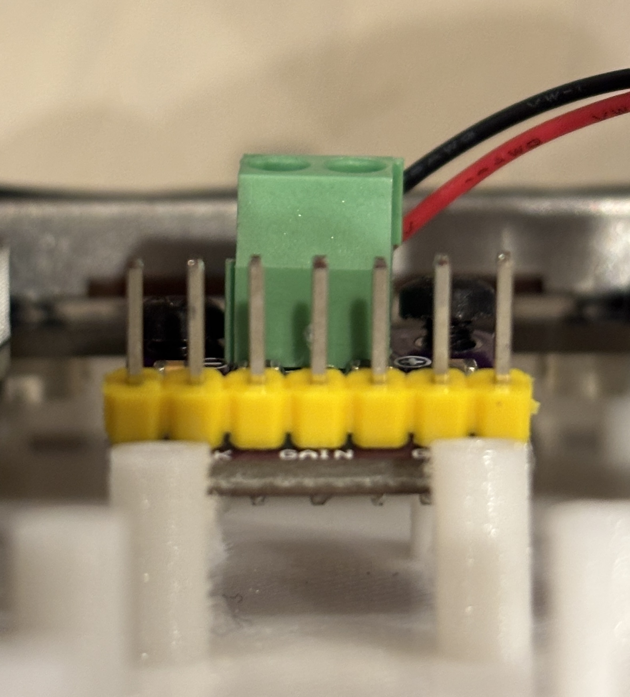
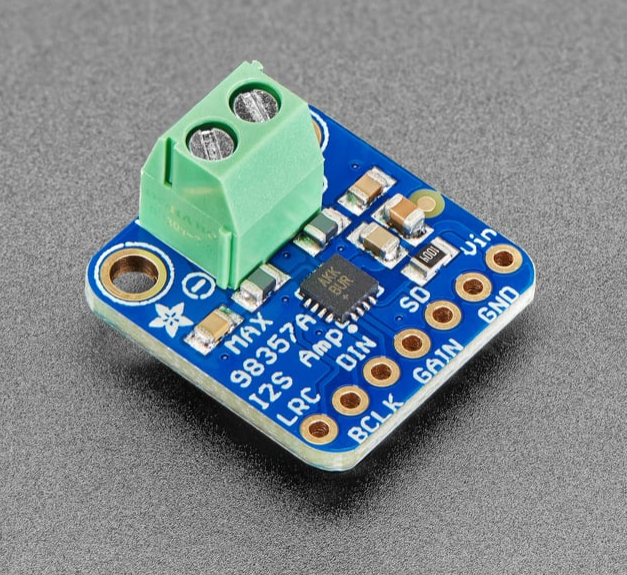
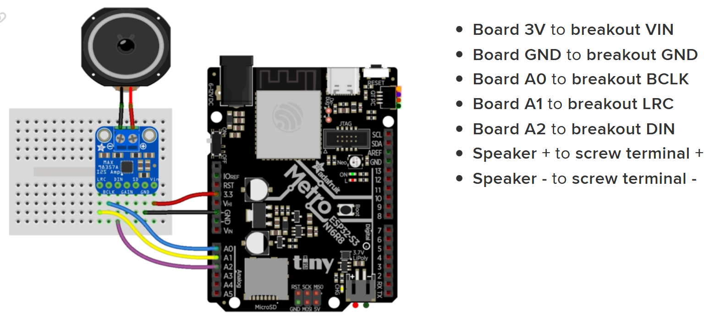
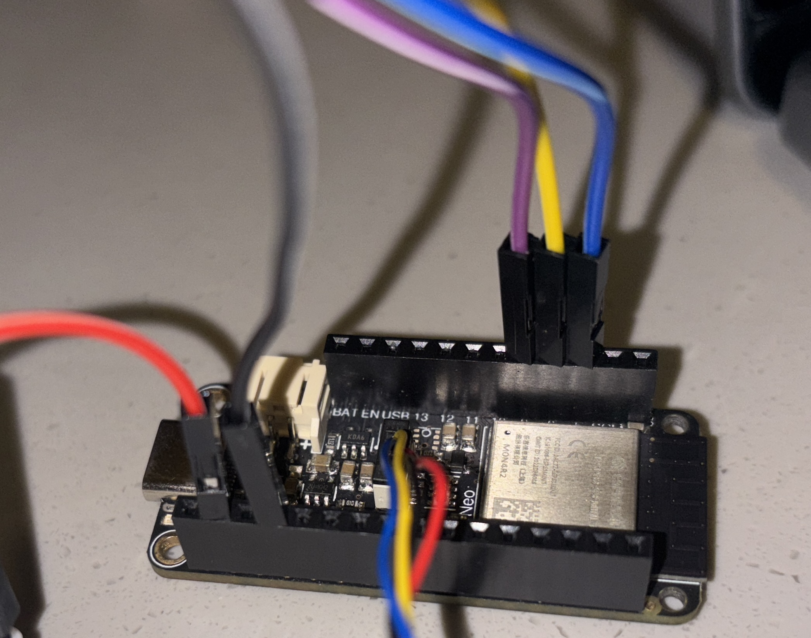
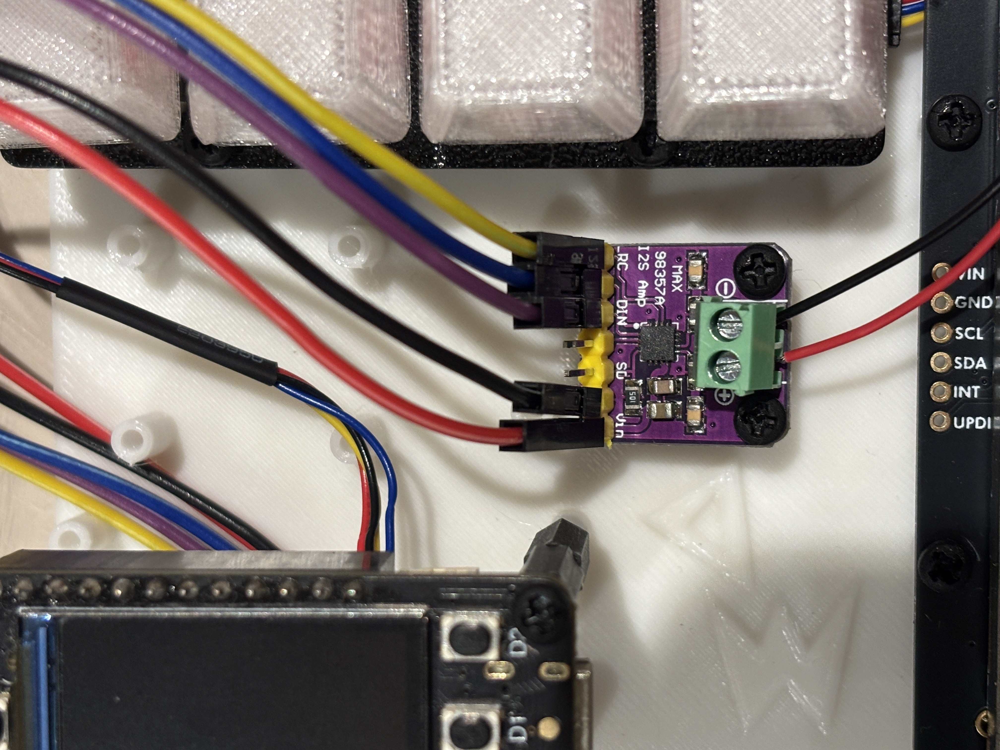
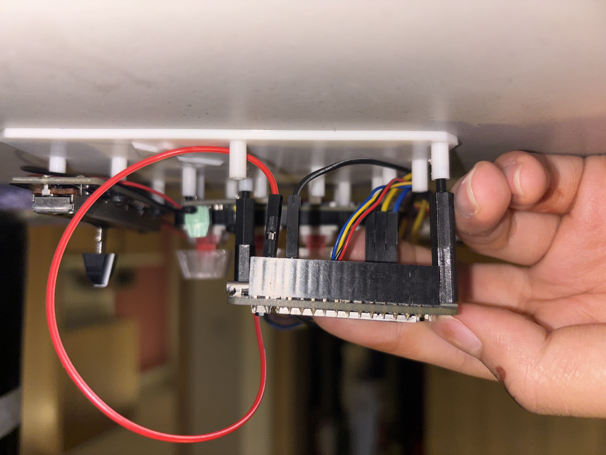
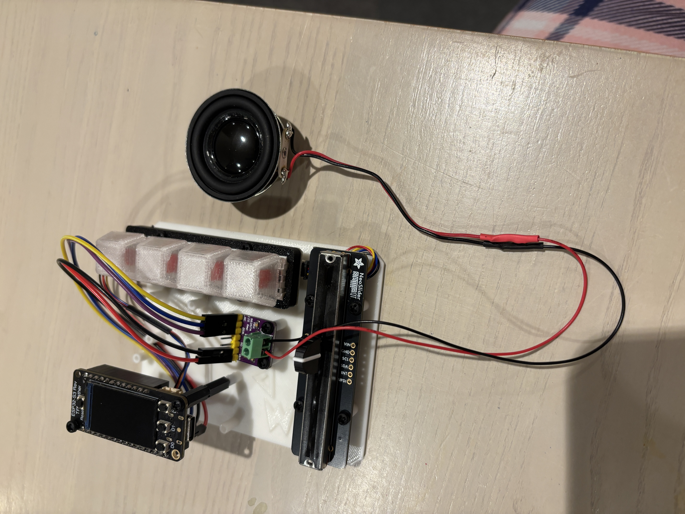

# Setting up Speaker Hardware & Software
Full tutorial here: [Adafruit Metro ESP32-S3](https://learn.adafruit.com/adafruit-metro-esp32-s3/i2s)
# Hardware
1. Soldering
  - Solder red and black wires to the speaker: red for (+), black for (-).
    -  
  - Solder the male pin header strip to the Amplifier Breakout (solder shorter end of pins to amplifier)
    - 
  - Solder green terminal block to the breakout board
    - 
2. Pin Connections
  -  The board in this example image is a little different than ours and we're gonna use the digital (D) pins instead of the analog (A) pins:
  - 
  - As pictured:
    - GND to GND in black
    - 3V to VIN in red
    - D5 (instead of A0) to BCLK in blue
    - D6 (instead of A1) to LRC in yellow
    - D9 (instead of A2) to DIN in purple
  - Connect the (+) on the speaker via red wire to the (+) on the green terminal block. Screw in the screw on top of the green terminal block to secure wires.
    - 
    - 
3. Final outcome
  - You'll need to use screw extensions to put our feather board back onto the portable 3D printed backing.
    - 
  - You can also screw in the amplifier board like so:
    - 

# Software
1. Tone playback example
   - Copy this code into your code.py file to get a tone/frequency to play from the speaker: 
   - [Tone playback python file](../CircuitPython/MoreExamples/lib/I2S_Tone_Playback.py)
2. WAV file playback example
   - Copy this code into your code.py file AND download this WAV file to play the file from the speaker:
   - [StreetChicken WAV file](../CircuitPython/MoreExamples/lib/StreetChicken.wav)
   - [Playback python file](../CircuitPython/MoreExamples/lib/wavPlayback.py)
     - This video explains the code pretty well: [WAV playback tutorial](https://www.youtube.com/watch?v=qfp6QRK8gMg)   
2. Synth sound example
   - Copy this code into your code.py file to get a synth sound to play from the speaker: 
   - [Synth sound python file](../CircuitPython/MoreExamples/lib/Filters_Synth.py)

