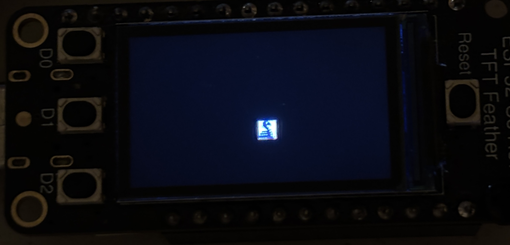

# Class Notes - Weeks 1-7

[Weekly Overview / Dates (Spreadsheet)](https://docs.google.com/spreadsheets/d/14s9f2PLqj50BRLKKCZjZiCTpdnHFVN-IBkaVPIkFLVE/edit?usp=sharing)

- [Week 1](#week-1) – Introduction / NIME, Music Devices, and Sound Installations
- [Week 2](#week-2) – Applied music theory, Western and beyond
- [Week 3](#week-3) – CircuitPython / Physical computing for NIME
- [Week 4](#week-4) – Musical interface design, MIDI
- [Week 5](#week-5) – Musical sensors
- [Week 6](#week-6) – Rapid prototyping
- [Week 7](#week-7) – Idea Lab
- 7-Week Finals Break
- [Week 8](WeeklySchedule2.md#week-8) – Project proposal development
- [Week 9](WeeklySchedule2.md#week-9) – Project proposal presentation, implementation starts!
- SPRING BREAK
- [Week 10](WeeklySchedule2.md#week-10) – Telling your story / documenting your work
- [Week 11](WeeklySchedule2.md#week-11) – Guest Speaker, project production
- [Week 12](WeeklySchedule2.md#week-12) – Music performance, project feedback, user testing
- [Week 13](WeeklySchedule2.md#week-13) – Final project production / polish
- [Week 14](WeeklySchedule2.md#week-14) – Final project presentations
- [IM SHOW](WeeklySchedule2.md#im-show) – Show final project / Update final documentation

Note: Exact due dates for assignments and readings are indicated in Brightspace

---

# Week 1

## Week 1.1

Introduction
- Class introductions
    - What's your technical background?
    - What's your experience with music?
    - What are you hoping to achieve in the course?
    - [Dunewind Resonator](https://kildall.com/newest-artworks/dunewindresonator) by Michael Ang and Scott Kildall
    - [Sonoglider Duet](https://kildall.com/newest-artworks/sonogliderduet) by Michael Ang and Scott Kildall
- Review syllabus
- Textbook at bookstore
    - [Push, Turn, Move (Bjooks)](https://bjooks.com/products/push-turn-move-the-book)
- Class kits will be distributed in class

## Week 1.2

Music Devices, NIME and Sound Installations
- [New Interfaces for Musical Expression (NIME)](https://www.nime.org/)
    - [NIME Music Proceedings (NIME)](https://nime.org/music/)
    - [NIME Installation Proceedings (NIME)](https://nime.org/installations/)
- [Guthman Musical Instrument Competition (Georgia Tech)](https://guthman.gatech.edu/)
- [Ten Instruments That Will Change How You Think About Music
 (Georgia Tech)](https://guthman.gatech.edu/feature/guthman-instruments-change-music)
- [Makey Makey (YouTube)](https://www.youtube.com/watch?v=rfQqh7iCcOU)
    - Using capacitive touch sensing to trigger sounds
- [Phobos, Dysfunctional Robotic Orchestra (Vimeo)](https://vimeo.com/235763130) composition by Carlos Guedes
- [Laser Harp](https://www.youtube.com/watch?v=sLVXmsbVwUs#t=20)
- [Ferrous (Landscape.fm)](https://www.landscape.fm/ferrous) - Handheld device for resonating metallic strings
- [Eric Singer's Heavy-Metal Robots: Sound Builders (YouTube)](https://www.youtube.com/watch?v=MavM_WgZCjQ)
<!-- 404
- [10 Sound Installations that Inspire and Create Connection (Medium)](https://medium.com/@oskarlindskog/10-sound-installations-that-inspire-and-create-connection-73eabd5ce075)
-->
- [Cave of Sounds](https://caveofsounds.com/) 
    - Public installation of 8 bespoke interactive musical instruments
- [Alternative MIDI Controllers: New Ways To Touch Music (Perfect Circuit)](https://www.perfectcircuit.com/signal/alternative-midi-controllers)
    - Some historical and current examples of commercial alternative MIDI controllers
 
- Technologies used in the course
    - [Arduino](https://www.arduino.cc/) - open source electronic prototyping platform
        - [Adafruit ESP32-S3 Reverse TFT Feather](https://learn.adafruit.com/esp32-s3-reverse-tft-feather/overview) - Arduino-compatible microcontroller board with builtin screen, battery charger, WiFi, and Bluetooth
        - various inputs and sensors
        - motors, light, and other physical outputs are possible
    - [Ableton Live](https://www.ableton.com/en/live/) - music production DAW, Ableton 12 Suite available in music lab, Lite licenses can be found
        - your final project can use other software
    - 3D design / printing
        - [Autodesk Fusion](https://www.autodesk.com/education/edu-software/fusion) - professional 3D modeling for manufacturing
        - [Prusa MK4S](https://www.prusa3d.com/product/original-prusa-mk4s-3d-printer-5/) - "workhorse" basic 3D printer with open source roots, 4x in IM Lab
    - [Laser cutting](https://www.instructables.com/Laser-Cutting-Basics/)
    - Other software / hardware depending on interests!


### Homework - Week 1.2

Due before start of next class

#### Reading 1 - Controllerism ####
- **Watch** [Moldover's Approach to Controllerism (1 of 2) (YouTube)](https://www.youtube.com/watch?v=L2McDeSKiOU)
- **Watch** [Moldover's Approach to Controllerism (2 of 2)
 (YouTube)](https://youtu.be/dznjQIarboY?si=oWTpcaw2dQ_p_V9q)
- **Read** [Moldover-The Godfather of Controllerism
(MIDI Association)](https://midi.org/moldover-the-godfather-of-controllerism)
    - What makes Moldover's approach to controller design effective or not effective?
    - How can combining controller design and sound design help you connect with an audience? What techniques are you planning to use?
- **Post** your response in the discussion forum
    - See Brightspace->Discussions->Readings for details
- **Be ready** to discuss the topic in class

---
# Week 2

## Week 2.1
Announcements
- Pick up book from Bookstore
    - Push, Turn, Move 
- Questions
    - Who has done tool training Fall 2023 or later?
    - Who has experience with Ableton Live or other music software?
    - More interested in performance, practical devices, or installations?

- Discuss Controllerism reading
    - [The How To Show - Moldover (YouTube)](https://www.youtube.com/watch?v=IwjiUSnjrQk)
        - Brief overview of (re)making a controller, setting up software, and creating a performance
    - [How to Build a Controller (Making of The Mojo) (YouTube)](https://www.youtube.com/watch?v=uqs59UrA11c)
        - Overview of choosing components and making a custom enclosure
        - In our class we'll be using an Arduino as the brain and making our own enclosures using 3D printing and laser cutting

- Look at NIME examples

Interactive music tutorial
- [learningmusic.ableton.com (Ableton)](https://learningmusic.ableton.com/index.html)
    - Interactive introduction to making music focused on the Ableton Live style workflow of sequencing drums and synthesizers
    - Possible to export from the [Playground](https://learningmusic.ableton.com/the-playground.html) into Ableton Live
    - [Song structure (Ableton)](https://learningmusic.ableton.com/song-structure/bury-it.html) - an example of a common song structure in pop music

What is a synthesizer?
- "A synthesizer (or synth) is an electronic musical instrument that generates audio signals." - [Synthesizer (Wikipedia)](https://en.wikipedia.org/wiki/Synthesizer)
    - Includes photographs of early synthesizers including the highly influential Moog Minimoog synthesizer that helped popularize synthesizers to the public
- An analog synthesizer uses primarily analog (non-digital) electronic circuits
    - The electronic circuits create oscillations that can be controlled and shaped in various ways
- [Wendy Carlos demonstrates her Moog Synthesizer in 1970 (YouTube)](https://youtu.be/4SBDH5uhs4Q?si=wMCGIsV-K7WG_cnj)
- Digital synthesizers use software code to create the sounds
    - They often recreate techniques used in analog circuits ("virtual analog" modeling)
    - They can incorporate simulations of physical systems such as resonators (physical modeling)
    - They can use stored or recorded waveforms
- [Learning Synths (Ableton)](https://learningsynths.ableton.com/)
    - Interactive site for learning about sound synthesis
    - May give you some inspiration on ways to map a control to a change in sound (input to change in synthesis parameters)

Sampling
- Taking existing sounds and re-sequencing them
- Became particularly popular through hiphop sampling in the 80s
- [AKAI MPC LIVE II Retro - making a beat with vinyl Sampling
  (YouTube)](https://www.youtube.com/watch?v=NUMBYbbG6tE)
- [Live Finger Drumming - Gnarly (YouTube)](https://www.youtube.com/watch?v=W9s8aPM8kK0)

Applied music theory, Western and beyond
- [Learn music theory in half an hour (Andrew Huang / YouTube)](https://youtu.be/rgaTLrZGlk0?si=n52AtMMm5wVyZF4t)
- [Music Theory For Beginners (Taetro / YouTube)](https://www.youtube.com/watch?v=CluuHrr7HG4&list=PLoO2tOP2r-XvoFc7cnfYcomf1X0XcQvDC)
- [Arabic maqam (Wikipedia)](https://en.wikipedia.org/wiki/Arabic_maqam)
- [Pitch is political: learning Arabic maqams and decolonizing music (CDM)](https://cdm.link/2024/08/pitch-is-political/)
- [tuning.ableton.com](https://tuning.ableton.com/)
    - "A tuning system is a way to organize musical pitch, by narrowing down from the infinite number of possible pitches to a usable subset."
    - [Listen (tuning.ableton.com)](https://tuning.ableton.com/introduction/listen/)
        - Different scales and corresponding Ableton files
     
### Homework
- Watch [Learn music theory in half an hour (Andrew Huang / YouTube)](https://youtu.be/rgaTLrZGlk0?si=n52AtMMm5wVyZF4t)
    - No response required
- Pick up class book from Bookstore

## Week 2.2
What is a DAW?
- A Digital Audio Workstation (DAW) is software that allows you to record, edit, and produce audio
- [What is a DAW? Your guide to digital audio workstations (Avid)](https://www.avid.com/resource-center/what-is-a-daw)
- Centerpiece of a music studio
    - Recording audio from instruments or microphones through audio interface
    - Sequencing notes on hardware or software instruments
    - Mixing audio
    - Adding effects
    - Exporting audio
- With a DAW like Ableton Live you have a complete music studio on your laptop!
    - Can do everything "in the box" using software instruments and recorded samples
    - Add an audio interface for recording from physical instruments and microphones
    - Connect with physical synthesizers / devices using MIDI
    - Add a MIDI controller to control the DAW including playback / record, mixing, software synthesizers, effects, etc

Workshop: Ableton, software synthesizers
- Introduction to Ableton Live 12
- Ableton Live editions
    - [Intro, Standard, Suite](https://www.ableton.com/en/live/compare-editions/)
    - Live 12 Suite is available in C3-116
    - Live Lite (free license) comes with many hardware controllers and some apps
        - iOS apps with free Live Lite license
          - [Koala Sampler](https://www.koalasampler.com/)
            - Settings -> Get Live Lite
          - [Ableton Note](https://www.ableton.com/en/note/)
            - Settings -> Get Ableton Live Lite
        - If you want a Live Lite license, ask Mang
- Ableton Live Tutorials
    - [learningmusic.ableton.com](https://learningmusic.ableton.com/index.html)
        - Simplified online learning of concepts used in Live as well as general overview of electronic music composition 
    - [Getting started with Live (Ableton)](https://www.ableton.com/en/live/learn-live/)
    - [Ableton Live for Beginners (Taetro / YouTube)](https://www.youtube.com/watch?v=RSnjD6xe5bM&list=PLoO2tOP2r-XsXH0lybWl9zMvYp3lpLF46)
    - [How To Use MIDI Controllers With Ableton Live (YouTube)](https://www.youtube.com/watch?v=YE6QVzrLNz0&list=PLoO2tOP2r-XsXH0lybWl9zMvYp3lpLF46&index=6)
    - [The NEW Ableton 12 Beginner Guide (in 22 Minutes) (YouTube)](https://www.youtube.com/watch?v=WMg4Y4q6FQ0)
- Default scale / tuning and using alternative tunings
    - [Using Tuning Systems (Ableton)](https://www.ableton.com/en/live-manual/12/using-tuning-systems/)
    - [tuning.ableton.com](https://tuning.ableton.com/)
    - [A Guide to the Maqam Tuning Presets for Ableton Live 12 (Ableton)](https://tuning.ableton.com/arabic-maqam/maqam-guide/)
    - Using Ableton tuning with VSTs
 
In-class workshop - Part 1
- Follow first two lessons from [Ableton Live for Beginners (Taetro / YouTube)](https://www.youtube.com/watch?v=RSnjD6xe5bM&list=PLoO2tOP2r-XsXH0lybWl9zMvYp3lpLF46)
    - [Ableton Live For Beginners (pt. 1)
 (Taetro / YouTube)](https://youtu.be/RSnjD6xe5bM?si=b2DxnyvIicIyD0Ab)
    - [Ableton Live For Beginners (pt. 2) (Taetro / YouTube)](https://www.youtube.com/watch?v=PIYRINw6Kog&list=PLoO2tOP2r-XsXH0lybWl9zMvYp3lpLF46&index=2)
    - Start making some basic music
    - To hear system audio (e.g. Chrome / YouTube) on headphones
        - Apple -> System Settings -> Sound Output -> Scarlet
    - To hear Ableton Live audio on headphones 
        - Live -> Settings -> Audio -> Audio Output Device -> Focusrite Scarlet
    - Physical volume knob above headphone jack also controls headphone volume
    - Save project to "SAVE HERE" drive
- Ask questions!
- Start making some music

In-class workshop - Part 2
- How to map your MIDI controller to a software instrument
    - [How To Use MIDI Controllers With Ableton Live (Taetro / YouTube)](https://www.youtube.com/watch?v=YE6QVzrLNz0&list=PLoO2tOP2r-XsXH0lybWl9zMvYp3lpLF46&index=7)
    - Click "MIDI" button at top right to enter MIDI mapping mode
    - Click on control you want to map
    - Press / wiggle control on physical MIDI controller to map the controls together
    - Click "MIDI" to exit MIDI mapping mode
    - Move your physical control and check that on-screen control also moves
- Adding effects to a track
    - Make Browser visible using icon at top-left, or View->Browser
    - Click Audio Effects
    - Drag and drop desired effect on a track
        - e.g. drag Delay onto an instrument track
    - Effect appears in device view
- Mapping a MIDI controller to effects
    - Effect controls can be mapped like any other control
- Recording a live performance into Ableton Live
    - Switch to the Arrangement view by pressing Tab
    - Press the big Record button
- Exporting your composition as a .wav + .mp3
    - [How to Export an MP3 File from Ableton Live (Berklee)](https://online.berklee.edu/help/en_US/ableton-live/1656745-how-to-export-an-mp3-file-from-ableton-live)
    - Switch to Arrangement view
    - Drag to select the time range you want to export
    - File -> Export Audio/Video
    - Rendered Track -> Main
    - Check the start time and length
    - Normalize -> On
        - Adjusts volume so maximum volume becomes maximum volume in recorded file
    - Encode PCM -> On
    - File Type -> WAV
        - Basic uncompressed / lossless audio file
        - Use this file to do further editing, for example in Audacity
    - Encode MP3 -> On
        - Smaller compressed file, suitable for sharing
    - Click Export
        - Save in SAVE HERE drive 
    - Find file
        - Right-click and Open With
            - QuickTime Player -> quick check that everything was recorded
            - Audacity -> further editing of wav file, e.g. trimming or exporting to specific formats
- Exporting your project as a zip file
    - [Transferring Projects to another computer (Ableton)](https://help.ableton.com/hc/en-us/articles/209071909-Transferring-Projects-to-another-computer#h_2cbf945b-14e3-43c1-ad2c-362b177662e9)
    - File -> Collect and Save All
        - Saves all used samples, etc into project directory so everything is together
    - Find project directory (e.g. 250127 Demo Project)
    - Right-click on directory -> Compress to create zip (e.g. 250127 Demo Project.zip)
- Practice mapping, recording, and exporting

Upcoming events at Arts Center
- [Artist Talk - Finding a Voice Between Tradition and Contemporary](https://publicprograms.nyuad.nyu.edu/en/the-arts-center/events/2025/february/finding-a-voice-between-tradition-and-contemporary.html) - Feb 11
- [Music Workshop with KOKOKO!](https://publicprograms.nyuad.nyu.edu/en/the-arts-center/events/2025/february/kokoko-workshop.html) - Feb 12
    - DIY instruments
    - They're visiting our class that day
- [Music Workshop with Cimafunk](https://publicprograms.nyuad.nyu.edu/en/the-arts-center/events/2025/february/afrocuban-music-workshop.html) - Feb 12
    - Afrocuban rhythms

### Homework - Week 2.2

Due before start of next class

<!--
- **Read** [Microtonality and the Struggle for Fretlessness in the Digital Age
 (CTM)](https://www.ctm-festival.de/magazine/microtonality-and-the-struggle-for-fretlessness-in-the-digital-age)
    - What do you think of Allami's statement "Modern technology, as much as it seems neutral and empowering, is heavily laden with cultural and political asymmetries that often go unnoticed and unchallenged."?
    - Can you think of examples where technology is biased towards a certain culture? How could the technology be changed to allow a wider range of expression?
- **Post** your response in the discussion forum
    - See Brightspace->Discussions->Readings for details
- **Be ready** to discuss the topic in class
-->

<!-- Old with tuning
- **Create** a musical composition in Ableton Live 12 using a non-standard scale
    - Make a short piece of music (max 2-3 minutes) with at least a main melody using Ableton's tuning feature
        - Use the bundled (tuning aware) instruments in Ableton or VST instruments that support Ableton's tuning system (see instructions above)
        - Feel free to add percussion and other elements as you wish
    - What tuning system interests you and why?
    - How does your choice of tuning system affect your composition?
    - References
        - [Using Tuning Systems (Ableton)](https://www.ableton.com/en/live-manual/12/using-tuning-systems/)
        - [Ableton Tuning Guide](https://tuning.ableton.com/)
        - [Explore the tuning systems in Live 12 (tuning.ableton.com)](https://tuning.ableton.com/introduction/where-to-go-from-here/)
-->
- **Create** a short musical composition in Ableton Live 12
- **See Brightspace -> Discussion -> Individual Exercises** for details
- **Post** your work in the discussion forum
    - See Brightspace->Discussions->Exercises for details
- **Be ready** to show / discuss the work in class

---

# Week 3

## Week 3.1
- Review homework

Overview of music devices
- [Korg Volca Keys](https://www.korg.com/us/products/dj/volca_keys/)
    - Basic synthesizer
- [Roland TR-808](https://en.wikipedia.org/wiki/Roland_TR-808)
    - Incredibly popular drum machine
    - Originally made in the 1980s and became popular with techno music producers
    - Along with the [Roland TR-909](https://en.wikipedia.org/wiki/Roland_TR-909) these are the "classic" drum machine sounds popular in house, techno, and other genres
 
Song Structures
- ["Bury It" song structure (learningmusic.ableton.com)](https://learningmusic.ableton.com/song-structure/bury-it.html)
 

Hardware kit
- [Adafruit ESP32-S3 Reverse TFT Feather (Adafruit)](https://learn.adafruit.com/esp32-s3-reverse-tft-feather/overview)
    - Uses Adafruit [Feather](https://learn.adafruit.com/adafruit-feather/overview) form factor
    - FeatherWings are similar to Arduino Shields - stackable add-on boards
    - QT connector allows connection to QT breakout boards
- STEMMA / QT / I2C breakout boards
    - I2C is a digital communication protocol for connecting different integrated circuits (ICs)
    - Uses 4 wires (Power, Ground, Data, Clock)
    - STEMMA / QT is a standard connector for the I2C bus
        - Convenient connection without soldering
    - [Working with I2C Devices (Adafruit)](https://learn.adafruit.com/working-with-i2c-devices/overview)
    - [I2C addresses of Music Devices kit components (Sheet)](https://docs.google.com/spreadsheets/d/1xVRkgUelCfqRvcu3c_-A4PI7lurgY0dIFDRF3tWYtEo/edit?usp=drive_link)
        - List of all the addresses our parts use
    - Reading/writing over I2C is slower than connecting directly to hardware like buttons and knobs
        - Can cause issues with e.g. missing incoming MIDI messages
- [Adafruit NeoKey 1x4 QT I2C Breakout (Adafruit)](https://learn.adafruit.com/neokey-1x4-qt-i2c)
- [Adafruit NeoSlider (Adafruit)](https://learn.adafruit.com/adafruit-neoslider)
- Many more sensors / boards available for checkout from IM Lab / Connect2
    - [NYUAD IM Resources (nyuadim)](https://www.nyuadim.com/resources/)
        - Lab hours
        - [Connect2 Arts Booking (Intranet)](https://nyuad-artsbooking.nyu.edu/)


### Homework Week 3.1

Due before start of next class

- **Pick up** course textbook *Push, Turn, Move* from Bookstore
- **Read** *Push, Turn, Move* pp. 14-27, 34
    - No response required

## Week 3.2
### Meet in IM Lab - C3-029
Workshop: CircuitPython / ESP32-S3
- [ESP32-S3 Reverse TFT Feather](https://learn.adafruit.com/esp32-s3-reverse-tft-feather/overview)
    - Microcontroller board that supports Arduino and CircuitPython
    - Builtin screen, battery charger, connector for QT / I2C peripheral boards
    - Supports Bluetooth Low Energy (Arduino only) and wifi (but not Enterprise wifi)
- [CircuitPython](https://circuitpython.org/)
    - Alternative to Arduino software that uses dynamically interpreted scripts (Python) rather than compiled code (C/C++)
    - Supported on many of the same hardware boards as Arduino
    - Development cycle
        - Plug CircuitPython board to computer
        - CIRCUITPY drive appears
        - Edit code directly on the CIRCUITPY drive
        - Hit save to start running your code
    - Advantages
        - For larger projects, much faster to see changes in code (no need to recompile entire program)
        - Can drag and drop small media files to the CIRCUITPY drive and access through code
    - Disadvantages
        - Newer with relatively fewer examples
        - Less access to low-level chip features like interrupts
        - Not all features supported by Arduino are supported on all boards
- One time setup
    - [Install CircuitPython (Adafruit)](https://learn.adafruit.com/esp32-s3-reverse-tft-feather/install-circuitpython)
    - Update bootloader
        - Lowest level of code running on the board, handles board startup
        - Follow instructions at bottom right [Install, Repair, or Update UF2 Bootloader](https://circuitpython.org/board/adafruit_feather_esp32s3_reverse_tft/)
    - Install CircuitPython 9.x
        - CircuitPython interpreter will run our .py script files
        - Includes code for making the CIRCUITPY drive appear
        - Follow instructions to [Install CircuitPython](https://learn.adafruit.com/esp32-s3-reverse-tft-feather/install-circuitpython)
            - Download CircuitPython 9.x uf2
            - Double click Reset button
            - Drag and drop .uf2 file to FTHRS3BOOT
            - Open CIRCUITPY drive
            - Copy [boot.py](https://github.com/mangtronix/MusicDevices/blob/main/CircuitPython/boot.py) to the CIRCUITPY drive
                - This file enable USB MIDI, which we'll use later
            - Unplug and replug the board
            - Check boot_out.txt on the CIRCUITPY drive, it should look like this
```
Adafruit CircuitPython 9.2.4 on 2025-01-29; Adafruit Feather ESP32-S3 Reverse TFT with ESP32S3
Board ID:adafruit_feather_esp32s3_reverse_tft
UID:468E3337EEC8
boot.py output:
Enabling USB MIDI
```

- [Install Mu editor](https://learn.adafruit.com/esp32-s3-reverse-tft-feather/installing-mu-editor)
- [CircuitPython Essentials](https://learn.adafruit.com/esp32-s3-reverse-tft-feather/circuitpython-essentials)
    - [Blink example](https://learn.adafruit.com/esp32-s3-reverse-tft-feather/blink)
    - [Digital input example](https://learn.adafruit.com/esp32-s3-reverse-tft-feather/digital-input)
    - [Digital input multiple buttons example](https://learn.adafruit.com/esp32-s3-reverse-tft-feather/digital-input-multiple-buttons)
    - [Neopixel example](https://learn.adafruit.com/esp32-s3-reverse-tft-feather/neopixel)
        - Note we have to install the Neopixel library in to CIRCUITPY/lib

<!--
- [Arduino IDE Setup for ESP32-S3 Reverse TFT Feather(Adafruit)](https://learn.adafruit.com/esp32-s3-reverse-tft-feather/arduino-ide-setup-2)
    - Install Arduino IDE
    - The board we are using is the Adafruit Feather ESP32-S3 Reverse TFT
    - We need to get the latest board support for ESP32 provided by the manufacturer (Espressif)
    - Add third-party board URL in Arduino IDE->Settings
        - `https://raw.githubusercontent.com/espressif/arduino-esp32/gh-pages/package_esp32_index.json`
    - Install Board Support Package via Tools->Board->Board Manager->Search for 'esp32 espressif'
    - To verify look for Tools->Board->ESP32 Arduino->Adafruit Feather ESP32-S3 Reverse TFT
    - We need to manually reset the board by pressing the reset button after uploading new code
- Verify that your software / hardware is working
    - [Load classic 'Blink' sketch (Adafruit)](https://learn.adafruit.com/esp32-s3-reverse-tft-feather/using-with-arduino-ide)
    - The first time we load the blink sketch can be a bit tricky because we need to overwrite the CircuitPython firmware that is pre-loaded on the board
- Run the factory shipped demo
    - Demonstrates using the TFT display, buttons, battery monitor, etc
    - Requires us to install several Arduino libraries into the Arduino IDE
    - [ESP32-S3 Reverse TFT Factory Shipped Demo (Adafruit)](https://learn.adafruit.com/esp32-s3-reverse-tft-feather/factory-shipped-demo-2)

- [Installing Libraries (Arduino)](https://docs.arduino.cc/software/ide-v1/tutorials/installing-libraries/)
-->

<!--
- Create our first MIDI controller using ESP32-S3 Feather
- Run sample code for sending our first note
    
    - [MIDIUSB_write.ino (GitHub)](https://github.com/arduino-libraries/MIDIUSB/blob/master/examples/MIDIUSB_write/MIDIUSB_write.ino)    
    - Sends note on/off in simple loop with blocking delay

    - TODO - ESP32 USBMIDI example
        - File -> Examples (ESP32 Reverse TFT) -> USB -> MidiController.ino
    - Install [MIDI Monitor](https://www.snoize.com/MIDIMonitor/) and check that MIDI notes are being received by your laptop
        - Alternatively use [Protokol](https://hexler.net/protokol)
    - MacOS
        - Install [Flynth](https://www.fingerlab.net/portfolio/flynth) and make some sound!
            - Settings -> MIDI (enabled) -> Select MIDI device
-->

### Homework - Week 3.2

Due before start of next class

- **Sign** [IM Program Policies](https://docs.google.com/forms/d/e/1FAIpQLSfCx-YtOJYsbzMRJEVwXrCxGyCoN2VpmJYbAhEhydcT_tIzmA/viewform) at nyuadim.com
- **Sign up** for Autodesk Fusion personal / education license
    - [Autodesk Fusion](https://www.autodesk.com/products/fusion-360/personal)
    - Will be used later in the course
- **Read** *Push, Turn, Move* pp. 14-27, 34
    - No response required
<!--
- **Peruse** the Control section of *Push, Turn, Move* pp. 60-123 to see a catalogue of different physical UI elements
    - Can skip the interviews for now
    - No response required
-->
<!--
- **Create** a basic MIDI controller
    - Write an Arduino sketch (.ino) that implements a basic MIDI controller on our ESP32-S3 Feather board
    - Your controller should send note on/off messages as well as continous controller messages
    - Use your MIDI controller to control sounds in Ableton Live
-->
- **Create** a CircuitPython sketch that responds to the 3 buttons
- **Post** your work in the discussion forum
    - See [Brightspace->Discussions->Individual Exercises](https://brightspace.nyu.edu/d2l/le/435258/discussions/topics/532535/View) for details
- **Be ready** to show / discuss your work in class

---

# Week 4

## Week 4.1
- Review homework
- New printer this semester: [Prusa XL](https://www.prusa3d.com/product/original-prusa-xl-assembled-5-toolhead-3d-printer/)
- Start downloading these tools:
    - [Visual Studio Code](https://code.visualstudio.com/) - popular code editor
    - [Protokol](https://hexler.net/protokol#get) - MIDI monitoring tool
    - [Flynth](https://www.fingerlab.net/portfolio/flynth) - MacOS simple synthesizer

Controller example
- [Arcana Instruments Strum Accessible Instrument (CDM)](https://www.synthtopia.com/content/2025/02/04/arcana-instruments-strum-accessible-instrument/)
    - "The Arcana Strum is an example of adaptive technology, designed to be able to be used by people with a wide range of physical and cognitive abilities."
    - [Arcana Strum (Arcana)](https://arcanainstruments.com/product/arcana-instrument/)
 
CircuitPython
- [How do I learn Python?](https://learn.adafruit.com/welcome-to-circuitpython/how-do-i-learn-python "How do I learn Python?")
- [CircuitPython Essentials](https://learn.adafruit.com/circuitpython-essentials/circuitpython-essentials)
    - [Pins and Modules](https://learn.adafruit.com/circuitpython-essentials/circuitpython-pins-and-modules)
    - [Digital In and Out](https://learn.adafruit.com/circuitpython-essentials/circuitpython-digital-in-out)
    - [Internal RGB LED](https://learn.adafruit.com/circuitpython-essentials/circuitpython-internal-rgb-led)
    - [NeoPixel](https://learn.adafruit.com/circuitpython-essentials/circuitpython-neopixel)
- [Arduino to CircuitPython](https://learn.adafruit.com/arduino-to-circuitpython/overview)
    - Comparison of Arduino and CircuitPython with examples of how to do similar tasks 
    - [Arduino to CircuitPython - time](https://learn.adafruit.com/arduino-to-circuitpython/time)
- [RGB color codes](https://www.rapidtables.com/web/color/RGB_Color.html)

Visual Studio Code with CircuitPython
- Download [Visual Studio Code](https://code.visualstudio.com/)
- Open the CIRCUITPY/code.py file
    - Install Python when prompted
- Make sure to Trust whenever prompted
- Disable PyLance (excessive error highlighting)
    - View->Extensions->Search->"PyLance" and clicking Disable
- Install [Serial Monitor](https://marketplace.visualstudio.com/items?itemName=ms-vscode.vscode-serial-monitor)
    - Install from [Serial Monitor webpage](https://marketplace.visualstudio.com/items?itemName=ms-vscode.vscode-serial-monitor) or View->Extensions->Search->"Serial Monitor" and click install
    - To open the Serial Monitor
        - Terminal->New Terminal
        - Click on the Serial Monitor tab
        - Select the Port (e.g. /dev/tty.usbmodem... - Adafruit)
        - Click Start Monitoring
    - Note: you may have to reselect the port and click Start Monitoring if you manually reset the board

MIDI - Musical Instrument Digital Interface
- Standard for communication between digital instruments dating back to the 80s
- Allows e.g. a controller keyboard to be hooked up to a synthesizer module, or computer to record notes from a controller and play them back on a software or hardware synthesizer
- [Introduction to the MIDI Standard (Indiana University)](https://cecm.indiana.edu/361/midi.html)
- [MIDI (Wikipedia)](https://en.wikipedia.org/wiki/MIDI) - comprehensive overview
- MIDI 1.0 is a very basic protocol
    - Uses 7-bit values (0-127)
    - Common messages
        - Note on/off
            - Based on 12-tone piano keyboard (e.g. C, C#, D, D#, E, F)
        - Continous controllers (CC) - e.g. knob value from 0-127
            - Can suffer from "stair stepping" audible artifacts
        - Pitch bend - 14-bit value from 0-16383
            - Pitch bend of 8192 means "no bend" / wheel centered
        - Modulation wheel - 14-bit value from 0-16383
            - Used to add expression depending on specific synthesizer / patch, e.g. player moves the mod wheel to smoothly change the sound
        - Clock, start, stop
        - System Exclusive - non-standard messages, e.g. upload / download synthesizer patch from software editor
    - Transmission speed / bandwidth is low (31250 bits per second, like an old modem)
        - Have to limit the rate of control change messages
        - [MIDI Advantages / Disadvantages (CCRMA)](https://ccrma.stanford.edu/~gary/controllers/midi.html)
    - Designed as unidirectional protocol, sender to receiver
        - e.g. keyboard -> sound module, MIDI keyboard -> computer -> synthesizer
        - controller and receiver have to be in agreement on control mapping
    - Not designed to represent fretless instruments or non-Western scales
        - [Oud Taksim Bayātī (بياتي, Uşşâk, Bayat) by Hesham Hamra (YouTube)](https://www.youtube.com/watch?v=1DrzYlc8DAM)
            - This performance would be very difficult to represent using MIDI as it uses notes outside the 12-tone Western scale and incorporates string articulations as an important aspect of the performance
        - Playing quarter tone and "microtonal" scales can be accomplished using specialized software or hardware
            - [47SOUL - Intro To Shamstep (YouTube)](https://www.youtube.com/watch?v=5N0phc4nK-0)
                - The keyboardist makes use of a special device ([Kelfar AK tuning converter](https://kelfar.net/ak-5-pro-world-scale-tuning-converter/)) designed specifically to enable Arabic scales for live performance
        - Demo of playing Maqam Bayati inside Ableton Live, using Western scale, Ableton tuning, and dedicated software instrument ([Taqsim SOLO](https://taqs.im/shop/solo/))
        - What kind of music did you grow up with? What instruments do your favourite musicians play? How well do you feel these instruments are represented in electronic music?
        - How do you think the instruments we have available affect the music we make and listen to?
- [MIDI for Makers (Adafruit)](https://learn.adafruit.com/midi-for-makers)
- MIDI 2.0
    - Just released in 2020, starting to be used
    - Allows bidirectional communication, "conversation" between devices
        - e.g. controller can ask "are you a mixer?" and configure itself accordingly or ask the name of a parameter that is being controlled in order to show it on a display as it's being manipulated
    - Higher resolution (e.g. 32-bit control values with 4 million steps)
    - More controllers
    - Better timing (e.g. play notes of chord together)
    - [What Musicians & Artists need to know about MIDI 2.0 (MIDI Association)](https://midi.org/what-musicians-artists-need-to-know-about-midi-2-0)
        - "Can MIDI 2.0 make it easier to have microtonal control and different non-western scales? Yes, MIDI 2.0 Voice Channel Messages allow Per Note precise control of the pitch of every note to better support non-western scales, arbitrary pitches, note retuning, dynamic pitch fluctuations or inflections, or to escape equal temperament when using the western 12 tone scale."
    - A bit early for us to use MIDI 2.0 but something to keep an eye on
        - [AM MIDI 2.0 Lib for Arduino (GitHub)](https://github.com/midi2-dev/AM_MIDI2.0Lib)

- [MIDI for Makers (Adafruit)](https://learn.adafruit.com/midi-for-makers/overview)
- [DIY USB Midi Controller With Arduino: a Beginner's Guide
(Instructables)](https://www.instructables.com/DIY-USB-Midi-Controller-With-Arduino-a-Beginners-G/)
- [Create a MIDI Device
 (Arduino tutorials)](https://docs.arduino.cc/tutorials/generic/midi-device/)
- [How to Build Arduino MIDI Controllers - The Complete Guide (Nerd Musician / YouTube)](https://www.youtube.com/watch?v=IwfycC8rLos)
- [MIDIUSB Library for Arduino
 (GitHub)](https://github.com/arduino-libraries/MIDIUSB)

- MIDI button example for ESP32-S3
    - [CircuitPython examples directory (GitHub)](https://github.com/mangtronix/MusicDevices/tree/main/CircuitPython)
        - Copy libraries in ```/lib``` to ```CIRCUITPY/lib```
    - [midi_demo.py (GitHub)](https://github.com/mangtronix/MusicDevices/blob/main/CircuitPython/midi_demo.py)
        - Sends NoteOn and NoteOff
    - [midi_buttons.py (GitHub)](https://github.com/mangtronix/MusicDevices/blob/main/CircuitPython/midi_buttons.py)
        - Sends NoteOn / NoteOff for each button

<!--
- Wireless MIDI
    - MIDI over classic / paired Bluetooth (older technique, not commonly used anymore)
    - MIDI over WiFi
        - Possible using [RTP-MIDI](https://midi.org/rtp-midi-or-midi-over-networks)
        - Not easily accessible for end-users
        - Generally complicated and difficult to use
        - [Share MIDI information over a network in Audio MIDI Setup on Mac (Apple)](https://support.apple.com/en-ae/guide/audio-midi-setup/ams1012/mac)
    - MIDI over Bluetooth LE (Low Energy)
        - Allows wireless connection to iOS, Mac, Android, Windows
        - Introduces some latency
            - Can be surprisingly low, but with larger pauses after some time
            - Competing for bandwidth with other devices like WiFi
        - iOS
            - Look for Bluetooth symbol in your app's MIDI settings
            - Or use [midimittr](https://apps.apple.com/us/app/midimittr/id925495245) to find and connect BLE controller
                - To connect a BLE controller go to Devices tab
        - MacOS
            - Audio MIDI Setup.app -> Window -> Show MIDI Studio -> (Bluetooth symbol)
                - After connecting the BLE controller will show as regular MIDI source
        - Android
            - [MIDI BLE Connect](https://play.google.com/store/apps/details?id=com.mobileer.example.midibtlepairing&hl=en)
        - Windows
            - Create a virtual loopback MIDI port using [loopMIDI](https://www.tobias-erichsen.de/software/loopmidi.html)
            - Use [BLE-MIDI Connect](https://apps.microsoft.com/detail/9nvmlzttwwvl?hl=en-US&gl=US) to scan for BLE controller and connect to loopback MIDI port
            - Go into your app and select loopback MIDI port
            - Controller -> loopMIDI -> music app
-->

### Homework - Week 4.1

Due before start of next class

- **Read** an interview that interests you in *Push, Turn, Move*
    - Summarize the points from the interview that most interest you in one paragraph
    - What do you think is the most important contribution that the interviewee has made to electronic instrument interface design?
    - What principles did you learn that you can apply to creating your own musical device?
- **Post** your response in the discussion forum
    - See Brightspace->Discussions->Readings for details
- **Be ready** to discuss the topic in class

## Week 4.2
### Meet in C3-116
Class Visit - KOKOKO!
- [KOKOKO!](https://www.kokokomusic.com/)
- [KOKOKO!: NPR Music Tiny Desk Concert](https://www.youtube.com/watch?v=wA7MgcgqaZA)
- [Performance Thursday 7pm](https://publicprograms.nyuad.nyu.edu/en/the-arts-center/events/2025/february/tamaas-festival.html)


Reading Discussion
- Push, Turn, Move interviews

Device example
- [Circle Guitar (YouTube)](https://www.youtube.com/watch?v=gMPO4oCp_6I&t=41s)
    - Rotary wheel with plectrums strums guitar strings
    - Buttons and knobs control Ableton

<!--

Workshop: MIDI controllers, wired and wireless
- Create a wireless MIDI controller
    - Install [ESP32-BLE-MIDI library (GitHub)](https://github.com/max22-/ESP32-BLE-MIDI)
    - Load [01-Basic-Midi-Device (GitHub)](https://github.com/max22-/ESP32-BLE-MIDI/blob/master/examples/01-Basic-Midi-Device/01-Basic-Midi-Device.ino)
    - Modify example with your own unique device name
        - e.g. ```BLEMidiServer.begin("Mangtronix");```
    

- Latency in audio systems
    - What is latency?
        - Time between something being triggered (e.g. pushing a button) and sound being received by listener
        - [How Latency Works (Ableton)](https://help.ableton.com/hc/en-us/articles/360010545559-How-Latency-Works)
        - [How to reduce latency (Ableton)](https://help.ableton.com/hc/en-us/articles/209072289-How-to-reduce-latency)
    - Audio buffer size is a primary source of latency in software systems
        - Larger buffers allow CPU to process audio in larger chunks (more efficient) but increase latency
        - To minimize latency choose the smallest buffer size that does not cause CPU overloading
    - Tools for measuring latency
        - Play your device and see if it feels laggy
        - Record events / audio in Ableton
        - [Is It Snappy? (iOS app)](https://isitsnappy.com/)
            - Visually measure latency using high framerate video
    - Musicians can adapt to a *fixed* latency by playing notes earlier
    - Wireless connections can add a variable latency
        - Interference and transmission loss can cause packets to be retransmitted
    - The operating system and input/output system also adds latency
        - [Why is there so much latency on my android device?
 (Koala Sampler)](https://www.koalasampler.com/help/android/why-is-there-so-much-latency-on-my-android-device/)
-->
     
- Example projects in CircuitPython
    - Portable MIDI Controller (with 4x4 buttons)<br/>
          - Controller with 4x4 DIY button pad controlling DAW<br/>
              - [YouTube demo](https://www.youtube.com/watch?v=kVHYq4UNdmo)<br/>
              - [GitHub code](https://github.com/rounak-dutta/RPI-Pico-16-BTn-MIDI-Controller-using-CircuitPython)<br/>
              - <br/>
    - Build a Traffic Light Project with Pico W and CircuitPython<br/>
          - Create a functional traffic light with three LEDs and two buttons<br/>
              - [Youtube demo](https://youtu.be/cWePx-Bhepg?si=ivknhK_roJqRvfXw)<br/>
              - [Website tutorial with code](https://www.cytron.io/tutorial/build-a-traffic-light-project-with-pico-w-and-circuit-python)<br/>
              - <br/>
    - Soundboard Speaker for Bikes & Scooters<br/>
          - CircuitPython portable soundboard speaker for any bike or scooter<br/>
              - [Youtube demo](https://youtu.be/K5RtX5pPXEo?si=aK-l8V-C1oc4mYlC)<br/>
              - [Website tutorial with code](https://learn.adafruit.com/soundboard-speaker-for-bikes-scooters)<br/>
              - <br/>
    - IoT Bird Feeder Camera<br/>
          -  Captures images of birds with Adafruit IO and CircuitPython (seperate designed and 3D printed bird feeder to house the Adafruit MEMENTO, a large battery, and a PIR sensor)<br/>
              - [Youtube demo](https://youtu.be/LhUypbEh9XU?si=-ylcg0S37f_Es-zS)<br/>
              - [Website tutorial with code](https://learn.adafruit.com/iot-window-bird-feeder-with-camera)<br/>
              - <br/>
    - CircuitPython Light Meter OLED<br/>
          - Create a simple Light Meter programmed in CircuitPython using a Seeeduino Xiao board, a photoresistor, and an OLED display<br/>
              - [Youtube demo](https://youtu.be/zjhoc0t7I_0?si=wFkQEEOTDLtd_5Ab)<br/>
              - [GitHub code](https://github.com/educ8s/CircuitPython-Light-Meter-OLED.git)<br/>
              - <br/>
    - Raspberry Pi Pico Clock & Thermometer<br/>
          - Build this low-cost real-time clock and thermometer with a color TFT display using CircuitPython on a Raspberry Pi Pico board.<br/>
              - [Youtube demo](https://youtu.be/gBofy7MMdIY?si=L0fCDNewATBOSTFH)<br/>
              - [Website tutorial with code](https://educ8s.tv/raspberry-pi-pico-thermometer-clock/)<br/>
              - <br/>
    - Animations on OLED displays<br/>
          - Load and display an animation on an OLED screen with CircuitPython<br/>
              - [Youtube demo](https://youtu.be/WqyBWcjs_oY?si=cx8jjEUhm263ez9p)<br/>
              - [Website tutorial and code](https://educ8s.tv/oled-animation/)<br/>
              - <br/>

- Demo of using code.py to load another file
    - Keep your code in another file, e.g. ```midi_buttons.py```
    - import (load/run) the module / file you want from ```code.py```
    - Makes it easy to switch between different files

[code.py (MD GitHub)](https://github.com/mangtronix/MusicDevices/blob/main/CircuitPython/code.py)
```
# Music Devices

# Uncomment the name of the file you want to run

# import multibutton
# import midi_demo
import midi_buttons # Send NoteOn/NoteOff from builtin buttons

# import spritesheet # Demo of bitmap sprites
```

- Sending MIDI from CircuitPython
    - Need to copy library files from [MusicDevices/CircuitPython/lib](https://github.com/mangtronix/MusicDevices/tree/main/CircuitPython/lib) to your ```CIRCUITPY/lib directory```
        - [MusicDevices repository zip file download](https://github.com/mangtronix/MusicDevices/archive/refs/heads/main.zip)
    - We are using the [adafruit_midi](https://docs.circuitpython.org/projects/midi/en/latest/api.html) library with the [usb_midi](https://docs.circuitpython.org/en/latest/shared-bindings/usb_midi/) library for transport of the MIDI messages over USB
        - [Using Adafruit USB MIDI (Adafruit)](https://learn.adafruit.com/grand-central-usb-midi-controller-in-circuitpython/code-usb-midi-in-circuitpython#using-adafruit-usb-midi-3016197)
    - [midi_demo.py (MD GitHub)](https://github.com/mangtronix/MusicDevices/blob/main/CircuitPython/midi_demo.py)
        - Sends NoteOn / NoteOff and Control Change messages
    - Checking MIDI messages using [Protokol](https://hexler.net/protokol)
        - Protokol->Settings->MIDI
            - Make sure your Feather is visible as an input
        - MIDI tab->Enabled
        - You should see MIDI messages sent from your Feather to your computer over USB
    - [midi_buttons.py (MD GitHub)](https://github.com/mangtronix/MusicDevices/blob/main/CircuitPython/midi_buttons.py)
        - Sends NoteOn / NoteOff from ESP32-S3 buttons
    - [spritekeys.py (MD GitHub)](https://github.com/mangtronix/MusicDevices/blob/main/CircuitPython/spritekeys.py) - for next class
        - Example using NeoKeys, NeoSlider, and display
        - You also need to copy CircuitPython/lib/spritesheet.png to CIRCUITPY/spritesheet.png
  
### Homework - Week 4.2

Due before start of next class
- **Sign up** for an Autodesk account - you should have received an invitation email

<!--
- **Integrate** the [midi_buttons.py (MD GitHub)](https://github.com/mangtronix/MusicDevices/blob/main/CircuitPython/midi_buttons.py) code with your homework from last week
    - In addition to showing the lyric and color, send NoteOn and NoteOff messages from your code
    
- **Check** that your sketch is sending the NoteOn / NoteOff messages using [Protokol](https://hexler.net/protokol)
-->
- **Play** with changing the note values in midi_buttons.py to see what happens
  - Find some combination that sounds nice to you
  - You could try cycling through notes instead of always playing the same note
- **No writeup required**


<!--
- **Create** a wireless MIDI controller
    - Write an Arduino sketch (.ino) that implements a wireless MIDI controller using Bluetooth LE
    - Make sure your device advertises a unique device name
    - Use your MIDI controller to control sounds in Ableton Live
- **Post** your work in the discussion forum
    - See Brightspace->Discussions->Exercises for details
- **Be ready** to show / discuss your work in class
-->
   
---

# Week 5

## Week 5.1
### Music Devices Tutorial Videos
[](https://youtube.com/playlist?list=PLu4XhOBNpasRh4gECFa_265TXL6ad-JZS&si=HkdT5z8YmPgwWKKj)
- [Music Devices YouTube Playlist](https://youtube.com/playlist?list=PLu4XhOBNpasRh4gECFa_265TXL6ad-JZS&si=HkdT5z8YmPgwWKKj)
  - [Kit Assembly](https://youtu.be/vAgwV33kiOU?si=QKxKICChgR6l4rMc)
  - [Code Loading](https://youtu.be/gwZex-az2hU?si=E-3hAvah1zIFgp7R)
  - [NeoKey Code](https://youtu.be/80llQv0Q1WA?si=rYfYmgNDvY5Ikkgp)
  - [NeoKey with NeoSlider](https://youtu.be/xHsPLdk2F3g?si=xtr8p8tNdD0yENxc)

Example Devices
- [Afternoon Generative Ambient (Vimeo)](https://vimeo.com/914151652?share=copy#t=0) by Mangtronix
    - Modular synthesizer generative composition
    - The different modules of the synthesizers are connected together then the whole system runs by itself to "generate" the music
- [HiChord Pocket Synthesizer](https://hichord.shop/)
    - Pocketable musical devices that lets you play chords modulated by a joystick
    - [HiChord demos on TikTok](https://www.tiktok.com/@hichord)


### Homework

Due before start of next class
- **Complete** these tutorials
  - [Kit Assembly](https://youtu.be/vAgwV33kiOU?si=QKxKICChgR6l4rMc)
  - [Code Loading](https://youtu.be/gwZex-az2hU?si=E-3hAvah1zIFgp7R)
  - [NeoKey Code](https://youtu.be/80llQv0Q1WA?si=rYfYmgNDvY5Ikkgp)
  - [NeoKey with NeoSlider](https://youtu.be/xHsPLdk2F3g?si=xtr8p8tNdD0yENxc)


## Week 5.2
Musical sensors
- What types of input do we want to sense?
- How expressive are our inputs and outputs?
- What feedback does the performer get?
- Continuous vs quantized
    - Fretless oud vs fretted guitar
    - Upright bass vs Fender "Precision" Bass
- Novice vs expert users
- User interface elements
    - [Workflow: Finding Inspiring Instruments (Bjooks)](https://bjooks.com/blogs/blog/workflow-finding-inspiring-instruments)
        - Interface difficulty vs User skills
            - Simple interface satisfies initial curiosity, but leads to boredom for advanced users
            - Difficult interface is initially frustrating and puts off novice users, but can be rewarding for advanced users
        - See also *Push, Turn, Move* pp. 24-27
         
- Sensors we have available
    - Buttons
        - [Builtin buttons on ESP32-S3 Reverse TFT Feather](https://learn.adafruit.com/esp32-s3-reverse-tft-feather/digital-input-multiple-buttons)
        - Additional buttons can be connected directly to the ESP32 by using an available GPIO logic pin, see [ESP32-S3 logic pins](https://learn.adafruit.com/esp32-s3-reverse-tft-feather/pinouts#logic-pins-3138952)
        -  [Capacitive touch](https://learn.adafruit.com/esp32-s3-reverse-tft-feather/capacitive-touch) can be used to create touch sensitive areas using metallic pads
    - Analog to digital
        - Can measure voltage, for example from a potentiometer, fader, or other resistive sensor
        - [Analog In example for ESP32-S3](https://learn.adafruit.com/esp32-s3-reverse-tft-feather/analog-in) using builtin ADC converters
        - [ADS7830 8-Channel 8-Bit ADC with I2C](https://www.adafruit.com/product/5836) gives an additional 8 channels of analog sensing over the QT / I2C bus
            - [CircuitPython example code (Adafruit)](https://learn.adafruit.com/adafruit-ads7830-8-channel-8-bit-adc/circuitpython-and-python#circuitpython-usage-3159061)
    - Rotary encoder
        - [I2C Rotary Encoder (Adafruit)](https://learn.adafruit.com/adafruit-i2c-qt-rotary-encoder/overview) - rotary encoder with button and NeoPixel
            - [CircuitPython example code](https://learn.adafruit.com/adafruit-i2c-qt-rotary-encoder/python-circuitpython#circuitpython-and-python-usage-3096111)    
    - Distance
        - [Adafruit VL53L4CD Time of Flight Distance Sensor
](https://learn.adafruit.com/adafruit-vl53l4cd-time-of-flight-distance-sensor)
            - [CircuitPython example code (Adafruit)](https://learn.adafruit.com/adafruit-vl53l4cd-time-of-flight-distance-sensor/python-circuitpython#circuitpython-usage-3112891)


I2C / QT addresses
- [Working with I2C Devices (Adafruit)](https://learn.adafruit.com/working-with-i2c-devices/overview])
- Each QT board has its own address and each board must have a unique address
- We read and write to each board over the same I2C / QT bus (4 wire connector) by specifying the board's address
- [Stemma QT / I2C connector on ESP32-S3 Feather board (Adafruit Pinouts)](https://learn.adafruit.com/adafruit-esp32-s3-feather/pinouts#stemma-qt-3115995)
- [Music Devices I2C Addresses](https://docs.google.com/spreadsheets/d/1xVRkgUelCfqRvcu3c_-A4PI7lurgY0dIFDRF3tWYtEo/edit?usp=sharing)
- **Note:** the NeoKey and NeoSlider each have the same default address (0x30). Cut the A3 jumper on the back of the NeoSlider to change its address to 0x38 (see [NeoSlider address](https://learn.adafruit.com/adafruit-neoslider?view=all#address-jumpers-3107357))

        
Common controller interface elements
- Button
  - [I built an Arcade DIY MIDI controller with an Arduino Pro Micro: The Fliper (Nerd Musician/YouTube)](https://www.youtube.com/watch?v=nv42rTRwKIg)
- Rotary potentiometer (pot)
  - [4# How to Code Potentiometers (Complete Guide) - MIDI Programming for the Arduino (Nerd Musician/YouTube)](https://www.youtube.com/watch?v=hcm5H6f8MI8&t=1797s)
- Linear potentiometer (fader)
  - [Arduino ribbon synth explanation (gr4yhound/YouTube)](https://www.youtube.com/watch?v=YpkzLo6yx_g)
- Keys
  - [How To Make Arduino Piano With Buzzer | | Tinker Cad (Mr. Screw Driver/YouTube)](https://youtu.be/FoXk6OL8GfQ?si=bV51UJTCKdfoOd2O&t=22)
- Pitch / Mod Wheels
- Indicators / displays
  - LED
    - Numeric display
    - Text Display
      - [Arduino based Decibel Meter with Sound Sensor & LCD Display (IoT Project Ideas/YouTube)](https://www.youtube.com/watch?v=4pqeavhW_is)
    - Graphic display
- Touch surface
  - Linear
  - XY Pad
    - [Touch Screen as a MIDI Ribbon Controller (MITXela)](https://mitxela.com/projects/ribbon_controller)
  - Capacitive Touch
    - [Touch Sensing Midi Controller! | Capacitive Touch and Arduino (The Maker Monster/YouTube)](https://youtu.be/DQ7lrEOZrwc?si=JUcSrtJURW6rNfP-&t=351)
- Flex Sensor
  - [DIY Music Glove - Rhythm in the Air (Jesse Yang/YouTube)](https://www.youtube.com/watch?v=WHePx-BSZvs)
  - [Project from NYU Shanghai Students](https://wp.nyu.edu/mattkerseydocumentationblog/2023/03/22/jazz-hands-matthew-kersey-gottfried-haider/)
- Pressure sensitivity
  - Piezo Vibration Disks
    - [Arduino MIDI Drums with Piezo Disc Triggers (with schematic and code)(Unrelated Activities/YouTube)](https://www.youtube.com/watch?v=TiwmAPjXFcE) 
  - Keyboard aftertouch
    - Monophonic / channel aftertouch
    - Polyphonic (MPE) aftertouch
  - Breath
    - DIY Breath Sensors 
      - [Simplest Breath Sensor for a MIDI Wind Instrument EVER - From a plastic water bottle (KontinuumLAB/YouTube)](https://www.youtube.com/watch?v=es92GqYBge0)
      - [KontinuumLAB WORKSHOPS: 3 DIY Breath Sensors (KontinuumLAB/YouTube)](https://www.youtube.com/watch?v=qmlhkcaMYX0&t=49s)
      - [The Harminator, original wind instrument. Worlds first prototype (KontinuumLAB/YouTube)](https://www.youtube.com/watch?v=y6OzpsGPxNU&t=127s)
- Controller motion
  - [Gyroscope / accelerometer (attitude sensors)](https://www.youtube.com/watch?v=Wzjms3tgF6w)
- Presence / human motion
  - Theremin
      - [I Built a MIDI THEREMIN! Theremidi - A DIY Arduino MIDI Controller (Nerd Musician/YouTube)](https://www.youtube.com/watch?v=CWPtxGrBlU8&t=499s)
  - Distance sensors
    - [Musical Instrument Using Arduino + Ultrasonic Distance Sensor (AutoDesk Instructables/Maker Saga)](https://www.instructables.com/Musical-Instrument-Using-Arduino-Ultrasonic-Distan/)
    - Camera tracking
- Light
  - Light Sensors
    - [Illumaphone: Light-based Musical Instrument With Arduino (AutoDesk Instructables/bonniee)](https://www.instructables.com/Illumaphone-Light-based-Electronic-Musical-Instrum/)
  - Laser distance
    - [Building LASER Harp with an Arduino (Science Shack/YouTube)](https://www.youtube.com/watch?v=pddGR5Eyc0Q)
- External data (data sonification)
  - Note: for our class we would build a real-time sensor interface
    - Wind
    - Plants
      - [/Biodata Sonification - Arduino Shield Breadboard Kit v02.pdf(Github)](https://github.com/electricityforprogress/BiodataSonificationBreadboardKit/blob/ac8b28a86406faa1d3ad3d88cac917c3296f4fc5/Biodata%20Sonification%20-%20Arduino%20Shield%20Breadboard%20Kit%20v02.pdf)
    - DNA sequence
    - Planetary motion
      - [The Sounds of a New Planetary System (NASA / YouTube)
](https://www.youtube.com/watch?v=2BCiOTJjcQQ)
    - Etc, etc
- Learning digitalio for graphical displays:
    - How it works:
        - [displayio Library Overview](https://learn.adafruit.com/circuitpython-display-support-using-displayio/library-overview)
        - [Using bitmaps and palettes](https://learn.adafruit.com/circuitpython-display-support-using-displayio/bitmap-and-palette)
    - Examples:
        - [Displaying text](https://learn.adafruit.com/circuitpython-display-support-using-displayio/text)
            - Download this library to use for the tutorial/code: [adafruit_display_text](https://github.com/adafruit/Adafruit_CircuitPython_Display_Text)
            - 
        - [Displaying a bitmap/image](https://learn.adafruit.com/circuitpython-display-support-using-displayio/display-a-bitmap)
            - Download the bitmap they provide to follow along: [purple flowers](https://cdn-learn.adafruit.com/assets/assets/000/074/681/original/purple.bmp?1555717198)
            - 
        - [Using sprites](https://learn.adafruit.com/circuitpython-display-support-using-displayio/sprite-sheet)
            - This example takes a sprite sheet of different sprites and displays each one over time every 2 seconds. Some of the sprites pictured below:
            - Download this image loader library and bitmap file to use for the tutorial/code: [adafruit_imageload](https://github.com/adafruit/Adafruit_CircuitPython_ImageLoad) + [sprite bitmap](https://cdn-learn.adafruit.com/assets/assets/000/074/925/original/cp_sprite_sheet.bmp?1556152347) 
             
             
             
        - [Drawing pixels on screen](https://learn.adafruit.com/circuitpython-display-support-using-displayio/draw-pixels)
            - 
            - The tutorial uses black and white, but you can change the colors to play around with it:
            - 
        - [Manipulating tiles and bitmaps to form groups](https://learn.adafruit.com/circuitpython-display-support-using-displayio/sprite-sheet)
            - Download this image loader library and bitmap file to use for the tutorial/code: [adafruit_imageload](https://github.com/adafruit/Adafruit_CircuitPython_ImageLoad) + [bitmap](https://cdn-learn.adafruit.com/assets/assets/000/075/025/original/castle_sprite_sheet.bmp?1556343110)
            - 
    - Useful helper libraries (fonts, shapes, buttons, etc.):
        - You can also directly download from our CircuitPython --> lib folder. All the digitalio libraries are in there. 
[Helper Libraries](https://learn.adafruit.com/circuitpython-display-support-using-displayio/helper-libraries)

Workshop: Musical sensors
- Connect buttons to trigger notes
- Connect potentiometers / faders to send CCs
- Connect a different sensor, e.g. LDR light sensor
    - Trigger note or CC
 
### Homework - Week 5.2

Due before start of next class
- **Choose** a song you like and modify our MIDI controller so you can play along with the song
- See [Brightspace Discussions->Exercise 3](https://brightspace.nyu.edu/d2l/le/435258/discussions/topics/534517/View) for details and to post your work

<!--
- **Perform** using your MIDI controller
    - Add more controls to your MIDI controller that allow you to perform a short piece of music in the style of Controllerism
    - Use at least one non-traditional UI element (something other than key, pot, fader)
        - e.g. light sensor, bend sensor, non-traditional switch
    - Create an Ableton Live set that goes with your MIDI controller
        - Some suggestions for possible integrations:
            - Trigger notes directly in instruments
            - Start / stop clips
            - Map to synthesizer parameters
            - Map to device parameters, for example arpeggiator settings
    - Record a short video of a performance using your controller and Ableton Live set
- **Post** your work in the discussion forum
    - See Brightspace->Discussions->Exercises for details
    - Host your video on a site like YouTube or Vimeo and embed it in your post
- **Be ready** to show / discuss your work in class
-->

---

# Week 6

## Week 6.1
### Meet in C3-116

Autodesk Fusion Workshop
- You have been granted access to Fusion through your @nyu.edu email address
    - If you don't have an Autodesk account check your email for the "Welcome to Autodesk" invitation link
    - If you *already* have an Autodesk account Fusion will show up under "My Products" (no welcome email will be sent)
    - [Autodesk Fusion for education](https://www.autodesk.com/education/edu-software/fusion)
    - Your access is tied to my teacher access - it's also possible to apply for your own educational license
- Fusion is available in C3-116, C3-019 Film Edit Lab, or download to your own machine
- [Sign in](https://www.autodesk.com/education/edu-software/fusion) and go to Products to download

Video tutorials:
- [Music Devices Fusion 0 - Installation](https://youtu.be/5us5B8Kd23A?si=is5FpoX7s-aixaB-)
    - Downloading / accessing Fusion app
    - **Note:** to access the MangLab hub and Music Devices project you need to click the Team Account button in top left in Fusion and select MangLab and then click on the Music Devices project
    - [Switch between hubs (Autodesk)](https://help.autodesk.com/view/fusion360/ENU/?guid=FT-SWITCH-BETWEEN-TEAMS) for how to switch to the MangLab hub
    - You should also get an email invitation to join the hub


- [Music Devices Fusion 1 - Basic modeling](https://www.youtube.com/watch?v=-jZU_3DBTc4)
    - Follow tutorial to create the knob
    - Expand the knob by adding more shapes, text, etc to turn it into something unique
        - [Rotary arm example (Fusion)](https://a360.co/3EPXycB)
- [Music Devices Fusion 2 - More modeling](https://youtu.be/iwORyv7a8Dg?si=hDeALyrmNELBr7YT)
    - Smoothing out the edges, adding text, idea for using the encoder as a rotary arm 

- More Fusion 360 tutorials
    - [Fusion 360 Complete Guide - MADE EASY 2024 (YouTube)](https://youtu.be/JyFbIpzzxFE?si=t3gltvMcdjBBVMcy)
        - Nice basic overview geared towards 3D printing  
    - [Fusion 360 for Absolute Beginners (Lars Christensen / YouTube)](https://www.youtube.com/playlist?list=PL40d7srwyc_Ow4aaOGXlP2idPGwD7ruKg)
        - Goes through modeling a complete part from scratch in a smart way using sketches and constraints
 
  
### Homework for next class
**Follow these video tutorials**
- [Music Devices Fusion 1 - Basic modeling](https://www.youtube.com/watch?v=-jZU_3DBTc4)
- [Music Devices Fusion 2 - More modeling](https://youtu.be/iwORyv7a8Dg?si=hDeALyrmNELBr7YT)
    - Create a folder with your name in the MangLab / Music Devices project
    - See [Switch between hubs (Autodesk)](https://help.autodesk.com/view/fusion360/ENU/?guid=FT-SWITCH-BETWEEN-TEAMS) for how to switch to the MangLab hub
    - Create a project with your knob within your folder

**Watch** this video tutorial to learn about different ways of modifying shapes and creating shapes using sketches
- [Fusion 360 Complete Guide - MADE EASY 2024 (YouTube)](https://youtu.be/JyFbIpzzxFE?si=t3gltvMcdjBBVMcy)

**Modify** your basic knob by adding text and / or changing the shape of the knob - be creative!

**Save** your work inside your folder in MangLab / Music Devices
    - e.g. MangLab hub, Music Devices project, Mang folder
    


## Week 6.2
### Meet on Zoom
[https://nyu.zoom.us/j/98623154843](https://nyu.zoom.us/j/98623154843)

Review homework from Week 5

Review Fusion 360

Introduction to rapid prototyping
- Laser cutting
    - [Laser Cutting Basics](https://www.instructables.com/Laser-Cutting-Basics/)
    - [IM Lab Laser Cutting presentation (Google Slides)](https://docs.google.com/presentation/d/1l6x9M0nAiH3uMHQKQtethxi2cAhx7vBo1srYkkMT4bA/edit?usp=sharing)
- 3D printing
    - [https://www.instructables.com/3D-Printing-Basics/](https://www.instructables.com/3D-Printing-Basics/)
    - Community models
        - User uploaded models
        - Quality varies
        - Good for test prints and inspiration
        - [Printables](https://www.printables.com/)
        - [Thingiverse](https://www.thingiverse.com/)
        - [Cults 3D](https://cults3d.com/)
    - Example files
        - [Simple Cherry MX Keycap (Printables)](https://www.printables.com/model/118708-simple-cherry-mx-keycap)
          - Printable keycap for our NeoKey board
          - Can be customized and printed in multi-colour
        - [Adafruit Example Projects (Adafruit)](https://learn.adafruit.com/category/3d-printing)
        - [Guitar Synth with CircuitPython SynthIO (Adafruit)](https://learn.adafruit.com/guitar-synth-with-circuitpython-synthio)
    - IM Lab Print Farm
        - 4x [Prusa MK4S with Input Shaper](https://www.prusa3d.com/product/original-prusa-mk4s-3d-printer-5/)
        - Ultimaker also available
    - [PrusaSlicer](https://www.prusa3d.com/page/prusaslicer_424/)
        - Converts solid 3D model to code for Prusa MK4 3D printers
        - Useful for estimating print time
        - Choose Prusa MK4S IS (Input Shaper) as the printer
        - Make sure to enable supports if model has overhangs
        - Can enable brim if model is very tall or has a small adhesion surface to bed


### Homework - Week 6.2

Due before start of next class

- **Create** a 3D design for a custom component for a musical device
- **See** [Brightspace->Discussions Exercise 4](https://brightspace.nyu.edu/d2l/le/435258/discussions/topics/535232/View) for details and to post your work
---

# Week 7

## Week 7.1
Idea Lab
- Opening remarks
- Share project ideas (come to front of class and share idea)
- Form groups
- Refine project ideas

## Week 7.2
## Workshop: 3D printing with IM Lab Instructor ##
Agenda:
- Show students laser cutter and materials available (no demo required since laser cutter inoperable)
- Show students MK4 printers
- Show students available 3D printing materials
- Guide students through slicing model with "lab assistant" and start 3D print
- Show students Prusa XL printer

- IM Lab Print Farm
    - 4x [Prusa MK4](https://www.prusa3d.com/product/original-prusa-mk4s-3d-printer-5/)
        - We have the MK4 version (not MK4S) but they are largely the same
        - Build volume is 250 x 210 x 220 mm | 9.84 x 8.3 x 8.6 in
        - Possible to manually change the filament colour at a specific height (e.g. to print label in different colour)
    - [Prusa XL](https://www.prusa3d.com/product/original-prusa-xl-assembled-5-toolhead-3d-printer/) available for larger and multi-material prints
        - Print volume is 360×360×360 mm (14.17’’×14.17’’×14.17’’)
        - Automatic colour changing
    - Other 3D printers available
        - Ultimaker in IM Lab
        - Print service at library (email them a file and go pick up the print)
- [Fusion 360](https://www.autodesk.com/products/fusion-360/personal)
    - Professional 3D modeling tool for Computer Aided Design (CAD) and Manufacturing (CAM)
- [PrusaSlicer](https://www.prusa3d.com/page/prusaslicer_424/)
    - Converts solid 3D model to code for 3D printer
    - Useful for estimating print time

Project proposal preparation
- Finalize project groups
- Start project proposal
- Individual group feedback sessions

### Homework - Week 7.2

Due before start of next class

- **Continue developing** your idea for your final project
---
# 7-Week Finals Break

